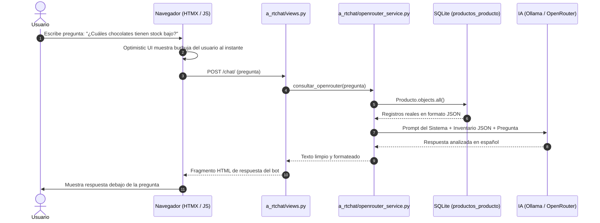

# 📘 MANUAL DE EJECUCIÓN, FLUJO DE ARCHIVOS Y ARQUITECTURA DE IA

**Proyecto:** Sistema de Gestión de Chocolatería Gourmet con CRUD e Integración de IA (Ollama / OpenRouter)  
**Asignatura:** Programación IV — Actividad 5  
**Estudiante:** Fernando Carlos Carrasco Condori  

---

## 📑 ÍNDICE GENERAL
1. [Requisitos e Instalación Paso a Paso](#1-requisitos-e-instalación-paso-a-paso)
2. [Flujo de Archivos del Proyecto (Estructura y Responsabilidades)](#2-flujo-de-archivos-del-proyecto)
3. [Cómo Conecta y Opera la IA con la Base de Datos](#3-cómo-conecta-y-opera-la-ia-con-la-base-de-datos)
4. [Doble Proveedor: IA Local (Ollama) vs API en la Nube (OpenRouter)](#4-doble-proveedor-ia-local-ollama-vs-api-en-la-nube-openrouter)
5. [Instrucciones Claras de Ejecución](#5-instrucciones-claras-de-ejecución)
6. [Validación y Pruebas Unitarias](#6-validación-y-pruebas-unitarias)

---

## 1. REQUISITOS E INSTALACIÓN PASO A PASO

### 1.1 Requisitos Previos del Sistema
- **Python 3.11 o superior** (verificado en Python 3.12).
- **Git** instalado en el sistema.
- **Ollama** (para ejecución 100% local sin internet):
  - Descargar desde: [ollama.com/download](https://ollama.com/download)
  - O en Windows mediante terminal: `winget install Ollama.Ollama`

### 1.2 Configuración del Entorno Virtual y Dependencias
Abre una terminal (PowerShell o Bash) dentro de la carpeta del proyecto `django_chat/`:

```bash
# 1. Crear el entorno virtual aislado
python -m venv .venv

# 2. Activar el entorno virtual
# En Windows (PowerShell):
.\.venv\Scripts\Activate.ps1
# En Windows (CMD):
.\.venv\Scripts\activate.bat
# En Linux / macOS:
source .venv/bin/activate

# 3. Instalar todas las librerías necesarias
pip install -r requirements.txt
```

### 1.3 Configuración del Archivo de Variables (`.env`)
El proyecto incluye una plantilla limpia llamada `.env.example`. Copia ese archivo para crear tu `.env` real:

```bash
# En Windows (PowerShell):
Copy-Item .env.example .env

# En Linux / macOS:
cp .env.example .env
```

Contenido clave dentro de `.env`:
```ini
DJANGO_SECRET_KEY=clave-secreta-de-desarrollo
DEBUG=True

# Elige el proveedor: 'ollama' (local) o 'openrouter' (nube rápida)
AI_PROVIDER=openrouter

# Si usas OpenRouter (opcional, para alta velocidad o VM sin GPU):
OPENROUTER_API_KEY=tu-clave-sk-or-v1-aqui
OPENROUTER_MODEL=liquid/lfm-2.5-2.6b:free

# Si usas Ollama Local:
OLLAMA_BASE_URL=http://localhost:11434
OLLAMA_CHAT_MODEL=productos-qwen2.5
```

---

## 2. FLUJO DE ARCHIVOS DEL PROYECTO

Cada archivo y carpeta cumple un rol específico en el ciclo de vida de la aplicación:

```text
django_chat/
│
├── a_core/                       # Núcleo de configuración Django
│   ├── settings.py               # Configuración global, variables .env e INSTALLED_APPS
│   ├── urls.py                   # Enrutador principal: enlaza a_home, productos y chat
│   └── wsgi.py / asgi.py         # Interfaces de despliegue del servidor
│
├── productos/                    # Aplicación principal del CRUD y Reportes
│   ├── models.py                 # Modelo Producto: código único, precio, stock, cacao, origen
│   ├── forms.py                  # Validaciones de formulario (precios no negativos, código único)
│   ├── views.py                  # Controladores: lista, crear, detalle, editar, eliminar y reportes
│   ├── urls.py                   # Rutas: /productos/, /crear/, /reportes/, etc.
│   ├── tests.py                  # Pruebas unitarias automatizadas (validaciones y reportes)
│   └── management/commands/
│       └── poblar_chocolates.py  # Comando para cargar los 7 chocolates iniciales en la BD
│
├── a_rtchat/                     # Módulo de Chat Inteligente
│   ├── views.py                  # Vista del chat, recepción de preguntas e integración HTMX
│   ├── openrouter_service.py     # Servicio desacoplado: extrae BD y consulta a OpenRouter / Ollama
│   └── templates/a_rtchat/       # Fragmentos parciales de mensajes (Optimistic UI)
│
├── templates/                    # Plantillas HTML frontend (TailwindCSS y HTMX)
│   ├── base.html                 # Layout general con el Widget Flotante del Asistente IA
│   └── productos/
│       ├── lista.html            # Catálogo visual de chocolates con buscador y tarjetas
│       ├── formulario.html       # Crear / Editar chocolate con alertas de validación
│       ├── detalle.html          # Ficha técnica del producto y valoración de lote
│       ├── reportes.html         # Panel analítico de los 5 reportes de inventario
│       └── eliminar_confirmar.html # Confirmación segura de borrado
│
├── static/ & media/              # Archivos estáticos e imágenes subidas de los productos
├── requirements.txt              # Lista exacta de librerías Python instaladas
├── manage.py                     # Utilidad de línea de comandos de Django
└── db.sqlite3                    # Base de datos SQLite relacional
```

---

## 3. CÓMO CONECTA Y OPERA LA IA CON LA BASE DE DATOS

El sistema implementa el principio de **Restricción de Respuestas a Datos Reales (Grounding)**: la IA no inventa nada; responde exclusivamente con lo que existe en la base de datos de Django.

### Diagrama del Flujo de Consulta:



### ¿Cómo se construye el contexto que recibe la IA?
En `a_rtchat/openrouter_service.py`, la función `_obtener_inventario_json()` serializa en tiempo real los chocolates registrados:

```json
[
  {
    "cod": "CHOC-001",
    "nom": "Barra Silvestre Alto Beni 85%",
    "cat": "Negro / Amargo",
    "precio": 35.0,
    "stock": 25,
    "estado": "Activo",
    "cacao": "85%",
    "origen": "Alto Beni, La Paz, Bolivia"
  },
  {
    "cod": "CHOC-004",
    "nom": "Trufas Artesanales al Café Yungueño",
    "cat": "Trufas",
    "precio": 55.0,
    "stock": 5,
    "estado": "Activo",
    "cacao": "70%",
    "origen": "Caranavi, La Paz, Bolivia"
  }
]
```

Ese JSON se inyecta dinámicamente en el prompt del sistema:
> *"Eres el Asistente Virtual de la Chocolatería. Responde basándote exclusivamente en el inventario JSON provisto. Si la información no existe, indica que no tienes datos suficientes."*

De esta forma:
- Si creas un chocolate nuevo en la web, la IA lo conoce en su siguiente respuesta sin reiniciar nada.
- Si eliminas un chocolate o cambias su stock a 0, la IA alertará de inmediato que está agotado.

---

## 4. DOBLE PROVEEDOR: IA LOCAL (OLLAMA) VS API EN LA NUBE (OPENROUTER)

El sistema aplica el patrón de diseño **Estrategia (Strategy Pattern)** mediante la variable `AI_PROVIDER` configurada en `.env`:

### Modalidad A: Modo 100% Local con Ollama (Para defensa sin internet)
1. Instala el modelo en tu máquina:
   ```bash
   ollama pull qwen2.5:1.5b
   ```
2. O crea el modelo con reglas integradas usando el Modelfile incluido:
   ```bash
   cd ollama
   ollama create productos-qwen2.5 -f Modelfile
   ```
3. En tu `.env`:
   ```ini
   AI_PROVIDER=ollama
   OLLAMA_CHAT_MODEL=productos-qwen2.5
   ```
4. Django se conectará a `http://localhost:11434/api/generate` de manera totalmente privada.

### Modalidad B: Modo Nube con OpenRouter API (Velocidad instantánea)
Ideal si se ejecuta en una máquina virtual o laptop sin tarjeta gráfica potente:
1. En tu `.env`:
   ```ini
   AI_PROVIDER=openrouter
   OPENROUTER_API_KEY=tu-clave-sk-or-v1-...
   OPENROUTER_MODEL=liquid/lfm-2.5-2.6b:free
   ```
2. Django envía el inventario a la API de OpenRouter con **fallback automático**: si la conexión a internet falla o el modelo da error 429, el código conmuta automáticamente a Ollama local para que el usuario nunca se quede sin respuesta.

---

## 5. INSTRUCCIONES CLARAS DE EJECUCIÓN

Sigue estos 4 comandos para poner en marcha el sistema completo desde cero:

### Paso 1: Ejecutar las Migraciones de la Base de Datos
Crea las tablas en SQLite:
```bash
python manage.py makemigrations
python manage.py migrate
```

### Paso 2: Poblar la Base de Datos con Chocolates de Prueba
Ejecuta el comando automatizado:
```bash
python manage.py poblar_chocolates
```
*(Cargará 7 chocolates con diferentes categorías, precios, stocks críticos y notas de cata).*

### Paso 3: Iniciar el Servidor de Desarrollo
```bash
python manage.py runserver 0.0.0.0:8000
```

### Paso 4: Abrir el Sistema en el Navegador
- **Catálogo y CRUD de Chocolates:**  
  `http://127.0.0.1:8000/productos/`
- **Panel de los 5 Reportes Analíticos:**  
  `http://127.0.0.1:8000/productos/reportes/`
- **Asistente IA (Widget Flotante):**  
  Visible en la esquina inferior derecha de cualquier página del sistema.

---

## 6. VALIDACIÓN Y PRUEBAS UNITARIAS

Para comprobar la robustez y calidad de software solicitada en la rúbrica (Punto 3.2):

```bash
python manage.py test
```

### ¿Qué validan las pruebas automáticas?
1. **Unicidad de Código:** Que no se puedan registrar dos chocolates con el mismo código `CHOC-001`.
2. **Validación de Precios:** Rechaza montos negativos (`-10.00`) o existencias negativas.
3. **Cálculo Exacto de Reportes:** Comprueba que las fórmulas de agregación (`Max`, `Min`, `Avg`, `Sum`) y detección de stock crítico (`< 10`) devuelvan resultados matemáticamente correctos.
