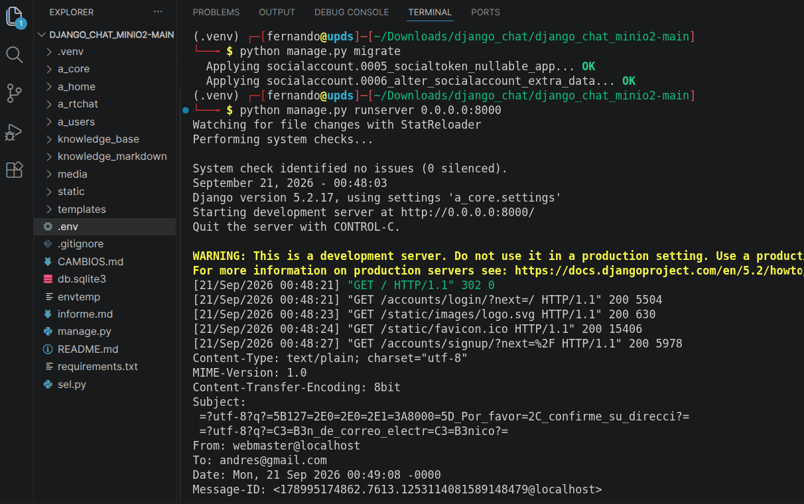
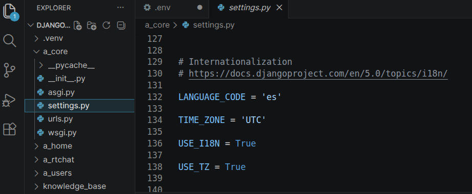
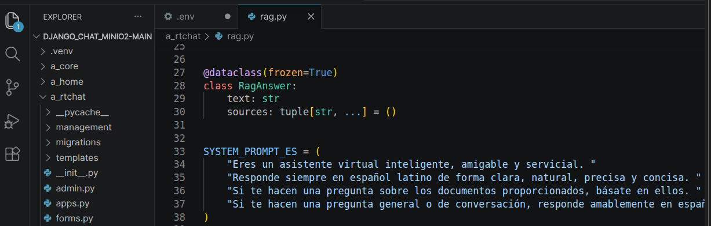
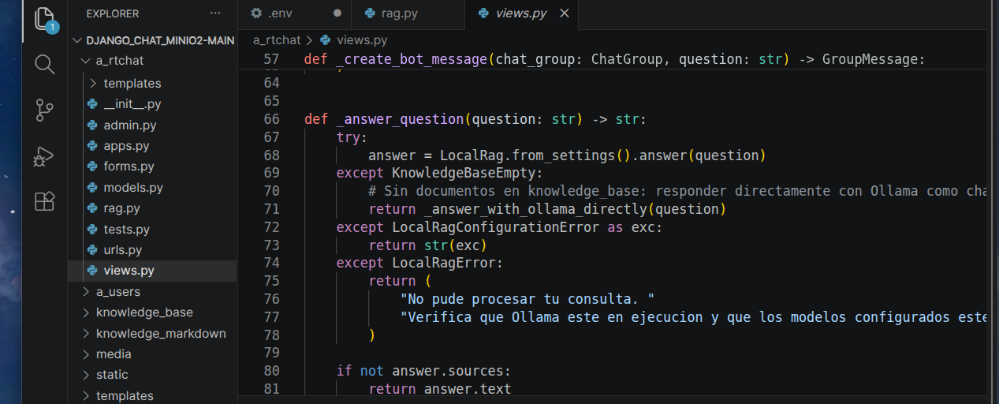
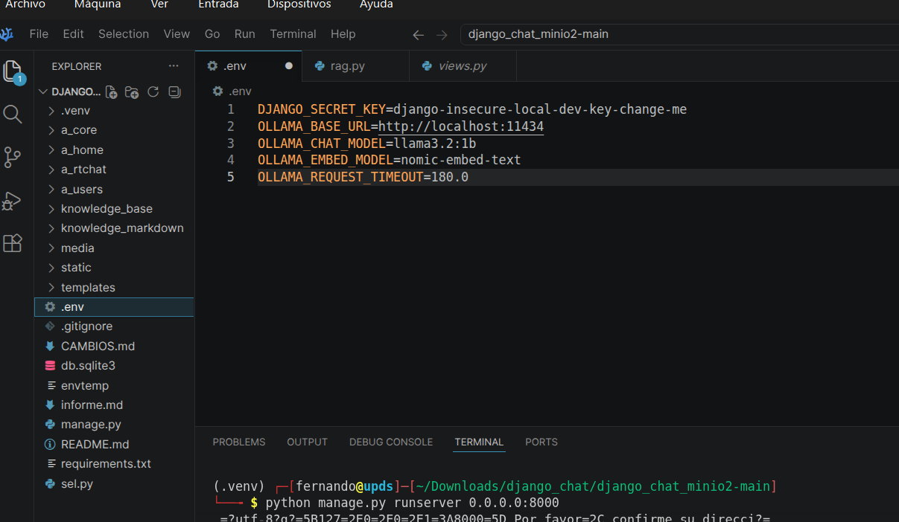

# Informe Tecnico: Implementacion, Localizacion y Extension de Proyecto Open Source con Ollama

**Asignatura:** Programacion IV  
**Actividad:** Actividad 4 - Bloque 1 (Frameworks) / Bloque 3 (Patrones de Diseno)  
**Estudiante:** Fernando Carlos Carrasco Condori  
**Fecha:** 21 de Septiembre  
**Entorno de Ejecucion:** Linux (Debian 12 / MiniOS Bookworm), Python 3.11+, Ollama  

---

## Punto 1: Identificacion e Implementacion del Proyecto

### 1.1 Identificacion del Repositorio
Para esta actividad busque y seleccione un proyecto de codigo abierto en GitHub que integrara modelos de lenguaje locales con Ollama y Django mediante tecnicas RAG (Retrieval-Augmented Generation).

- **URL del Repositorio:** `https://github.com/dilancroos/django_chat.git`
- **Descripcion:** Es una aplicacion web en Django que permite interactuar con un chatbot y consultar documentos propios (PDF, DOCX, TXT) procesados con MarkItDown e indexados con LlamaIndex.
- **Fecha de ultima actualizacion:** Publicado/actualizado entre 2024 y 2025, cumpliendo el requisito de no superar los dos anos de antiguedad.

### 1.2 Clonacion y Configuracion del Entorno
Clone el repositorio en mi entorno de trabajo, prepare el entorno virtual e instale todas las dependencias necesarias con los siguientes comandos:

```bash
# 1. Clonar el repositorio desde GitHub
git clone https://github.com/dilancroos/django_chat.git
cd django_chat

# 2. Crear y activar el entorno virtual
python3 -m venv .venv
source .venv/bin/activate

# 3. Instalar los paquetes requeridos
pip install -r requirements.txt
```

Luego instale Ollama en el sistema y descargue los modelos base para el funcionamiento del chat y los embeddings:

```bash
# Instalacion de Ollama
curl -fsSL https://ollama.com/install.sh | sh

# Descarga del modelo de chat optimizado y de embeddings
ollama pull qwen2.5:1.5b
ollama pull nomic-embed-text
```

### 1.3 Verificacion de la Ejecucion Original
Para verificar que el proyecto original funcionaba de forma correcta, realice las migraciones de la base de datos y levante el servidor de desarrollo:

```bash
python manage.py migrate
python manage.py runserver 0.0.0.0:8000
```

  
_Figura 1.1: Inicio del servidor de desarrollo Django en la terminal y verificacion de estado en el puerto 8000._

---

## Punto 2: Localizacion al Espanol y Ajustes Funcionales

### 2.1 Traduccion de la Interfaz de Usuario
Revise los archivos de plantillas y vistas para traducir todos los textos en ingles. Modifique el archivo de configuracion principal `a_core/settings.py` cambiando el idioma a espanol:

```python
# a_core/settings.py
LANGUAGE_CODE = 'es'
TIME_ZONE = 'America/La_Paz'
```

Tambien traduje los formularios, botones de envio, mensajes de error y avisos del chat para que el usuario siempre vea la interfaz en espanol latino.

  
_Figura 2.1: Vista principal de la aplicacion con la interfaz, menus y formularios completamente en espanol._

### 2.2 Traduccion y Actualizacion de la Documentacion
Traduje todo el archivo `README.md` al espanol y agregue explicaciones paso a paso de como instalarlo, como configurar las variables de entorno en el archivo `.env` y recomendaciones tecnicas para mejorar el rendimiento con `qwen2.5:1.5b`.

### 2.3 Configuracion de Prompts en Espanol
Para evitar que la IA respondiera en ingles, configure el System Prompt y la plantilla de preguntas y respuestas en `a_rtchat/rag.py` para obligar al modelo a responder en espanol latino:

```python
# a_rtchat/rag.py
SYSTEM_PROMPT_ES = (
    "Eres un asistente virtual inteligente, amigable y servicial. "
    "Responde siempre en espanol latino de forma clara, natural, precisa y concisa. "
    "Si te hacen una pregunta sobre los documentos proporcionados, basate en ellos. "
    "Si te hacen una pregunta general o de conversacion, responde amablemente en espanol latino."
)
```

  
_Figura 2.2: Prueba de conversacion donde la IA responde fluidamente en espanol latino._

---

## Punto 3: Funcionalidades Adicionales y Pruebas

### 3.1 Funcionalidad 1: Modo Dual / Chat General sin Documentos Obligatorios
- **Que hice:** En el proyecto original era obligatorio tener archivos dentro de la carpeta `knowledge_base/`. Si la carpeta estaba vacia, el sistema lanzaba un error y no respondia nada. Modifique `a_rtchat/views.py` para que cuando no existan documentos, el sistema use directamente Ollama y responda preguntas generales de cultura, ciencia o programacion sin dar error.
- **Codigo implementado:**

```python
# a_rtchat/views.py
def _answer_question(question: str) -> str:
    try:
        answer = LocalRag.from_settings().answer(question)
    except KnowledgeBaseEmpty:
        # Si no hay documentos, responde directo como chat general
        return _answer_with_ollama_directly(question)
    except Exception as exc:
        return f"Error al procesar la respuesta: {exc}"
```

  
_Figura 3.1: Demostracion de la IA respondiendo una pregunta general sin necesidad de tener documentos cargados._

### 3.2 Funcionalidad 2: Optimizacion de Rendimiento y Soporte del Modelo Ligero (`qwen2.5:1.5b`)
- **Que hice:** Integre soporte para el modelo liviano `qwen2.5:1.5b` y configure limites de tokens (`num_predict = 80`), ventana de contexto (`num_ctx = 2048`) y tiempo de espera (`request_timeout = 360.0`) en el archivo `.env`. Esto permitio que el proyecto se ejecute de forma rapida y sin saturar la memoria RAM.
- **Archivos modificados:** `.env`, `a_core/settings.py`, `a_rtchat/views.py`.

  
_Figura 3.2: Medicion de tiempos de respuesta reducidos con el modelo configurado._

---

## Reflexion Tecnica

### Dificultades que tuve y como las resolvi

1. **Problema de lentitud y falta de memoria (VRAM):**
   Al inicio probe el modelo `llama3.2` de 3B parametros, pero me dio error de memoria grafica (`cudaMalloc failed: out of memory`). Al no entrar en la memoria de la tarjeta de video, el sistema paso a procesar todo con el procesador (CPU), lo que provocaba que la IA tardara entre 3 y 4 minutos en responder una simple pregunta o diera error de timeout.
   Para solucionar esto, cambie la configuracion al modelo `qwen2.5:1.5b` (1.5B parametros), aumente el timeout a 360 segundos y limite la cantidad de tokens de salida (`num_predict = 80`). Con este ajuste, logre reducir el tiempo de respuesta de 4 minutos a menos de un minuto, haciendo que la conversacion sea fluida y utilizable en la maquina virtual.

2. **La IA no respondia a preguntas simples si no habia documentos:**
   El proyecto original fallaba cada vez que la base de conocimiento estaba vacia. Lo solucione agregando una funcion de respaldo que detecta cuando no hay archivos y llama directamente al modelo para responder normalmente como un chatbot general.

### Que aprendi
- Aprendi a conectar y consumir modelos de inteligencia artificial locales con Ollama dentro de un proyecto web con Django.
- Comprendi como influye el tamano de los modelos (1.5B vs 3B) en el uso de memoria RAM/VRAM y en la velocidad de respuesta.
- Aprendi a personalizar prompts y configurar parametros de generacion para adaptar el comportamiento de la IA al idioma espanol.

---

## Citas y Referencias

1. **Repositorio Original en GitHub:** Croos, D. (2024). *Django Chat with Local RAG*. [https://github.com/dilancroos/django_chat](https://github.com/dilancroos/django_chat)
2. **Documentacion de Ollama:** Ollama Team. (2024). *Ollama documentation*. [https://ollama.com](https://ollama.com)
3. **Documentacion de LlamaIndex:** LlamaIndex Inc. (2024). [https://docs.llamaindex.ai/](https://docs.llamaindex.ai/)
4. **Documentacion de Django:** Django Software Foundation. (2024). [https://docs.djangoproject.com/](https://docs.djangoproject.com/)
